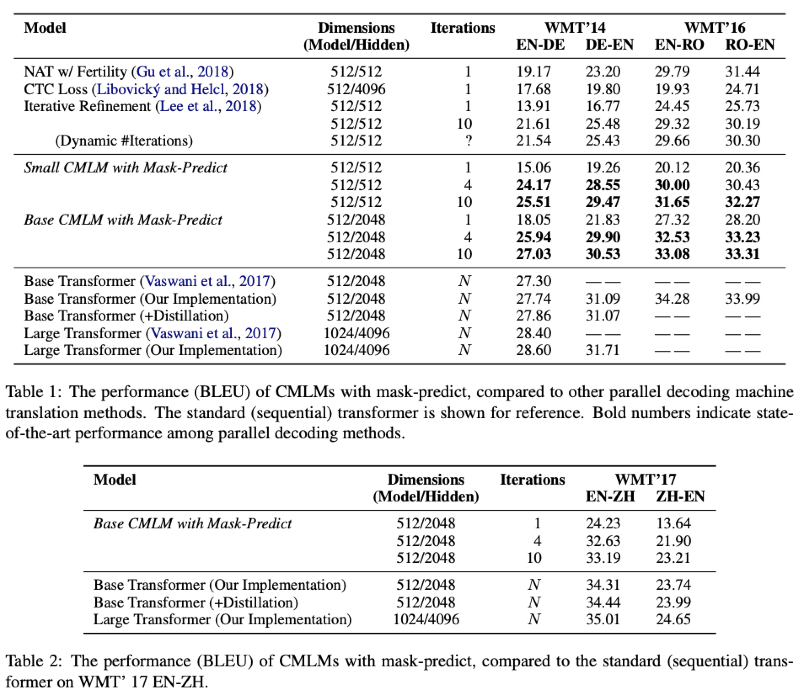
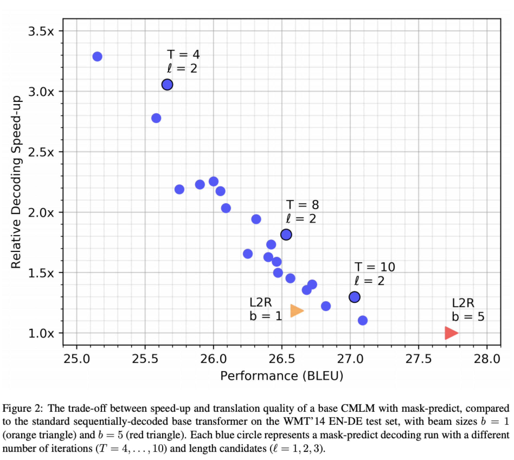
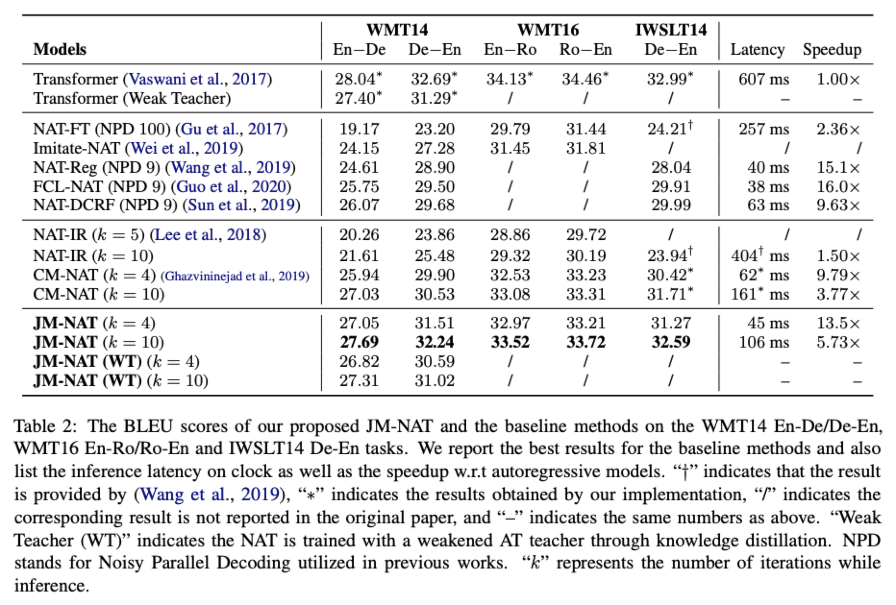

# Paper Notes: Mask-Predict & JM-NAT

读了2篇非自回归翻译模型(NAT, Non-Autoregress Translation)的论文。一篇是Facebook发表在EMNLP2019的Mask-Predict: Parallel Decoding of Conditional Masked Language Models，另一篇是中科大发表在ACL2020的Jointly Masked Sequence-to-Sequence Model for Non-Autoregressive Neural Machine Translation，是在前一篇的基础上做的进一步的工作。

这两篇论文的效果都基本接近Transformer模型的性能，在latency有显著的提升。

## Mask-Predict: Parallel Decoding of Conditional Masked Language Models

论文：https://www.aclweb.org/anthology/D19-1633.pdf

源代码：https://github.com/facebookresearch/Mask-Predict

### 整体思路

作者在decoder端引入了类似于BERT的Mask机制，将decoder input中的部分词语替换成Mask标签，然后预测被替换的正确内容。每一次预测后，将预测结果中score最低的部分内容替换成Mask，重新迭代预测，最终达到比较好的效果。

### 模型结构

- 作者将target中的内容分为y_mask和y_obs两类。y_mask表示被替换的部分，y_obs表示没被替换的部分（observation，decoder可见）。同时作者假设被替换的部分是互相条件独立的。
- 整体结构：与Transformer一致。但去掉了decoder中的attention mask，使得decoder的self attention可以看见所有的内容
- 训练目标：loss函数只计算y_mask部分的loss，不计算y_obs部分的loss。
- target序列长度问题：在encoder input上加入一个LENGTH标签，用LENGTH标签的encoder输出预测target长度再decode

### 推断过程

- 第一次迭代(t=0)，decoder input全是MASK
- 后续迭代，从上一次迭代结果中选取n个proba最低的token，替换为MASK，作为decoder input，n的数量随着迭代次数增加线性递减(n=N*(T-t)/T, N为预测的序列长度，T为最大迭代次数)

### 实验结果

- 训练了30w step 
- Transformer模型average on 5 ckpts, beam size=5
- MaskPredict模型选取了5个candidates

## Jointly Masked Sequence-to-Sequence Model for Non-Autoregressive Neural Machine Translation

论文：https://www.aclweb.org/anthology/2020.acl-main.36.pdf

源代码：https://github.com/lemmonation/jm-nat

### 作者思路

作者的模型是在MaskPredict的基础上进行的改进。先是通过两个实验来证明在NAT模型中，encoder的重要性大于decoder，顺理成章地将Mask操作引入到Encoder中；然后设计了多个loss进行联合训练。

### 详细思路

#### Encoder-Mask

作者设计了3个实验来证明Encoder的重要性高于Decoder；第一个是分别增加Encoder和Decoder层数，作者发现Encoder层数增加带来的BLEU提升显著高于Decoder；第二个是encoder和decoder的收敛速度，作者发现Decoder收敛更快；第三个是对encoder input、encoder output、decoder input分别加入噪声，作者发现encoder input加入噪声对BLEU的损害最为明显，encoder output次之，decoder input噪声对结果影响不是很大

作者使用BERT的mask策略，随机选取10%的词语进行替换（80%替换为MASK，10%替换为随机词语，10%保持不变），对选取到的词语，encoder output需要预测该词语，并计算loss，记为loss_enc。

#### Decoder-Mask

常规的nll loss，同样只计算y_mask，记为loss_nll

作者采用了一个n-gram based loss，来增强句子级的信息，避免词语重复问题，记为loss_gram，实验中n=2。（这块目前没有看得很懂）

#### Joint Learning

最终的loss_final=loss_nll+α*loss_enc+β*loss_gram，其中α, β=0.01

作者的模型还使用了sequence level KD，因此最终带来的提升包含KD的部分。

### 实验结果

Back to [Blog Index](../index)
