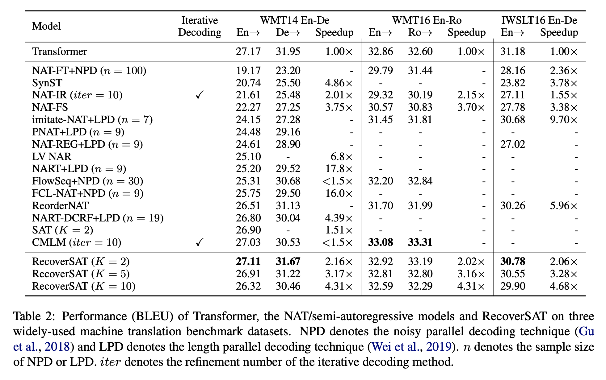

# Learning to Recover from Multi-Modality Errors for Non-Autoregressive Neural Machine Translation

## 背景

- NAT模型由于decoder的token之间信息沟通较少，存在多模态问题（multi-modality problem）和重复翻译问题
- 多模态问题：对于【很多农民】有[a lot | of farmers]和[lots of | farmers]两种翻译，NAT模型可能会交叉翻译成[a lot | farmers]或者[lots of | of farmers]

##  整体思路

- 通过将target分为多个segment的方式，实现了一种半自回归(Semi-Autoregressive neural machine Translation)的解码方式，还可以通过调整segment数量来在性能和效率之间进行trade-off
- 通过引入DEL标签，删除decode结果中内容重复的segment，缓解NAT模型解码结果重复问题和多模态问题

## 具体思路

- segment切分
	- decode方式
		- segment内部采用自回归的方式，从第一个token开始依次decode，直到生成EOS或者DEL标签，或者达到最大长度 
		- segment之间采用非自回归的方式
		- 即：第一步decode每个segment内的第一个token，第二步decode每个segment内的第二个token，直到所有segment内部都已经生成了EOS/DEL标签或者达到最大长度时，停止decode
	- 比较理想的切分方式是将句子相对均匀的切分成多个segment，能获得最大的加速效果
	- 切分方式
		- 指定segment数量K
		- 通过s~0-1分布采样，s=0时平均切分成K份，s=1时随机切分成K份，0-1分布的参数p为超参数
	- 实验发现，在训练过程中逐步p逐渐从1降为0能取得最佳效果
- segment删除
	- 原始数据本身并不能进行这样的训练，作者构造了伪语料来进行训练
	- 伪语料构造
		- there are lots of farmers doing this today → [there are] [lots of farmers] [doing this today] → [there are] [lots of farmers] **[lots of DEL]** [doing this today]
		- 通过超参数q控制插入DEL segment的比例
	- 实验发现，q=0.1~0.7之间效果较好，q=0.5时bleu最高，q=0.1时翻译重复率最低

## 实验结果

- 能取得非常接近甚至超越base transformer的结果
- 与CMLM(Mask Predict)相比，只有En-Ro稍微差一些
	- 作者的意见是CMLM是迭代式的NAT模型，通过迭代10次来达到较好的效果，但是损失了推断速度
	- 另一个可能的原因是CMLM使用了效果更好的teacher model来做KD
- 尽管作者声称推断速度远高于其它模型(>4x speedup)，但是这是K=10牺牲了效果的结果，为了效果采用K=2时，加速比并不显著，但是仍然远快于transformer

 

Back to [Blog Index](../index)
