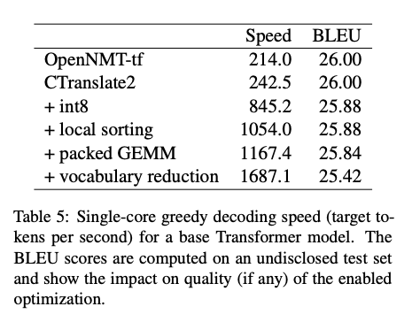
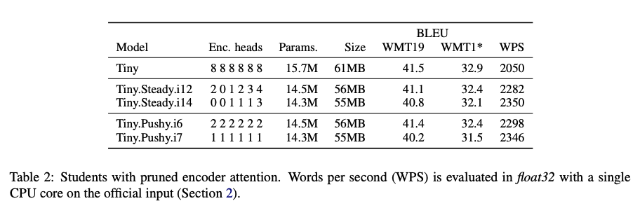
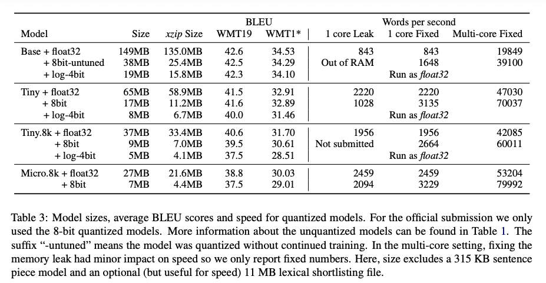
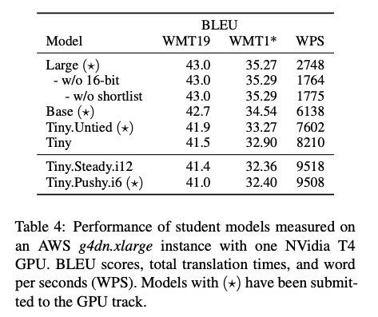
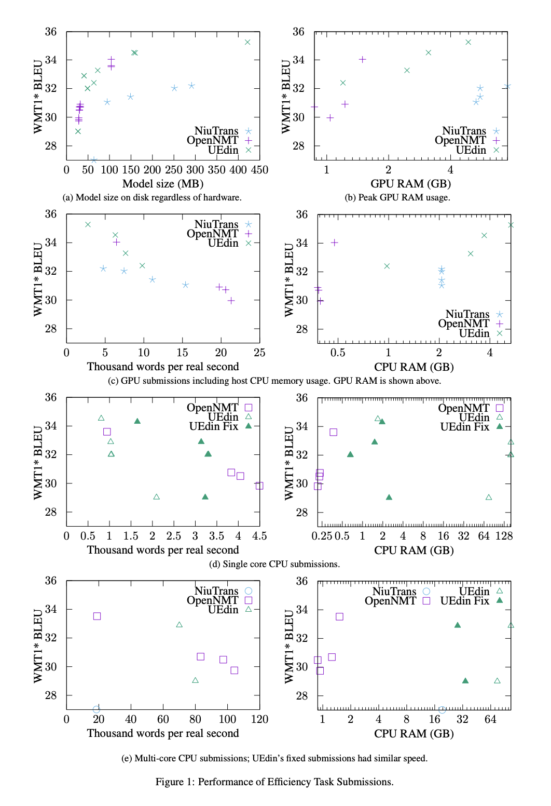

# WNGT2020 Efficiency Task Notes

这两篇是WNGT2020比赛中Efficiency Task的两篇论文，希望能对提升翻译模型效率有所帮助。

# Efficient and High-Quality Neural Machine Translation with OpenNMT

## 训练思路

- Distillation: 使用开源的翻译模型(Facebook WMT 2019)生成数据，用于翻译小模型
- 使用langid判断语种并过滤了5%样本
- 用于distillation的数据
    - a)高质量平行语料: 7.4M
    - b)低质量平行语料: 26.1M
    - c)单语语料: 127M
- 定义5M样本为一个epoch，按5:2:2的比例分别从a/b/c中随机采样得到
- student model最终比teacher model效果更好(43.0 vs. 42.1)

## 推断优化

- 缩减参数规模：减少decoder层数、减少hidden_size和filter_size
- 使用了CTranslate2来解码
- 8bit量化
- 不使用beam decode，跳过softmax layer
- attention cache
- 在机器物理核心较多的时候，将文件拆分，每个核心单独起一个进程来decode
- 每次读入8N(N=batch_size, tokens)的样本，对样本从长到短排序，动态调整batch size。已经decode完的样本会被移除
- shortlist/vocabulary reduction

# Edinburgh’s Submissions to the 2020 Machine Translation Efficiency Task
## 训练思路

- Distillation：4×Ensemble 
- 数据处理
    - 平行语料从8-best中选取，单语语料beam_size=4
    - 用FastText对语种进行分类并过滤语料
    - 用一个Transformer-base模型对样本进行打分，作为样本权重；从每个数据集中移除了5%得分最低的样本
    - 最终训练样本包括20M平行语料和185M伪语料
- 不使用dropout和label smoothing，其它超参与Marian的Transformer-base一致
- Decoder使用SSRU
- sentencePiece，vocab_size=32k
- tied模型相比于untied模型，对效果影响不算小
- shortlist

## 注意力头剪枝

- 在训练中裁剪multi-head att中的head
- 在6×1的模型上进行，对encoder进行剪枝
- 最终提交的模型裁剪了36(out of 48)
- CPU上速度提升10%，GPU上提升15%（以words per second计）
- BLEU损失约0.4

## CPU推断优化

- 8bit量化（intgemm）：速度提升40%~100%，效果下降0~0.2
- 24进程*2线程，输入文件拆分（拆分为48进程会导致性能受制于内存带宽）

## GPU推断优化

- 半精度推断，速度提升13~56%（视模型大小不同）效果几乎无损

 
# 各个track的可视化结果

 

Back to [Blog Index](../index)
